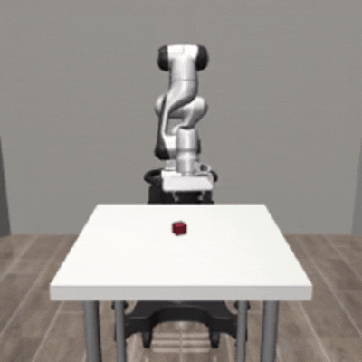

# 🚀 速通OpenPI 本地部署（远端推理）简易实现

## 📋 基本信息
- **任务环境**：robosuite "Lift" 场景，使用 Panda 机械臂抓取红色方块
- **任务描述**：`"grasp the red box"`
- **效果演示**：  
<p align="center"></p>

- **代码说明**：utils 和 demo.py 基于 OpenPI 的 [libero 示例](https://github.com/Physical-Intelligence/openpi/blob/main/examples/libero/main.py) 修改，精简了冗余代码✂️


## 🛠️ 本地部署环境(已测试)
- 操作系统: ubuntu20.04 (实测不支持windows)
- **Python 版本**：3.10 
- **依赖库**：
  - moviepy==2.2.1
  - msgpack_python==0.5.6
  - numpy==2.3.2
  - Pillow==11.3.0
  - robosuite==1.5.1
  - websockets==15.0.1


## ⚡ 快速启动指南

### 【服务器端】部署（显存要求>=24G）
* 参考openpi官方部署Libero微调后模型
    ```bash
    #!/bin/bash

    # 1. 创建并激活环境
    conda create -n openpi_env python=3.11 -y
    conda activate openpi_env

    # 2. 克隆项目代码
    git clone https://ghfast.top/https://github.com/Physical-Intelligence/openpi.git  # 无需 --recurse-submodules
    cd openpi/

    # 3. 安装项目依赖（需科学上网）
    pip config set global.index-url https://mirrors.tuna.tsinghua.edu.cn/pypi/web/simple
    pip install uv
    export UV_DEFAULT_INDEX=https://mirrors.tuna.tsinghua.edu.cn/pypi/web/simple
    GIT_LFS_SKIP_SMUDGE=1 uv sync

    # 4. 下载并解压模型权重（10G）
    wget https://www.modelscope.cn/models/masheng/pi0-fine-Tuned-Models/resolve/master/pi0_fast_libero.zip
    unzip pi0_fast_libero.zip -d $HOME/.cache/openpi/openpi-assets/checkpoints/

    # 5. 启动推理服务(会自动连接到HuggingFace)
    export HF_ENDPOINT=https://hf-mirror.com
    uv run scripts/serve_policy.py --env LIBERO
    ```


### 【本地端】运行
1. **创建环境并安装依赖**  
   ```bash
   conda create -n pi0_demo python=3.10
   conda activate pi0_demo
   git clone https://github.com/yueduduo/pi0_fast_deploy.git
   cd pi0_fast_deploy
   pip install -r requirements.txt
   ```

2. **配置服务器地址和端口**  下载额外的文件
   修改 demo.py 中 `Args.host` 与 `Args.port` 参数，填写你的服务器 IP 地址 🔧

3. **运行演示程序**  
   ```bash
   python demo.py
   ```
   在命令行输入`grasp the red box` 回车即可

4. **结果保存**  
   运行生成的视频将保存至 `Args.video_out_path`（默认路径：`./output/videos`）📹


## 💡 小建议
- 可通过修改 demo.py 中的 `getenv` 函数和 `eval_my_env` 函数，实现不同仿真环境的切换，拓展更多任务场景 🔄


## ⚠️ 注意事项
> 运行的 pi0 模型不支持跨机器人直接部署，例如从 Panda 更换为 UR5 时，可能导致任务失败。如需更换机器人，需重新微调适配模型。


## ✨ 支持一下
如果觉得本项目有帮助，欢迎点亮 star 🌟、点赞收藏转发一键三连哦！